## Algorithms

## Evaluate Performance of Algorithms
we evaluate the performance of an algorithm **in terms of its input size**
### Time Complexity:
a mount of time taken by the algorithm to run, as a function of input size.

### Space Complexity
a mount of memory taken by the algorithm to run, as a function of input size


## How to represent complexity of the algorithm
**Asymptotic notations:** Mathematical tools to represent time and space complexity.

- Big-O Notation (O-notation): Worst case scenario.
- Omega-notation (Ω-notation): Best case scenario.
- Theta-notation (Θ-notation): Average case scenario.


## Big-O Notation (O-notation)
The number of steps that an algorithm takes is the primary factor in determining its efficiency.
However, we can’t simply label one algorithm a “22-step algorithm” and
another a “400-step algorithm.” This is because the number of steps that an
algorithm takes cannot be pinned down to a single number. Let’s take linear
search, for example. The number of steps that linear search takes varies, as it
takes as many steps as there are cells in the array. If the array contains twenty-two elements, linear search takes twenty-two steps. If the array has 400
elements, however, linear search takes 400 steps.
The more accurate way to quantify efficiency of linear search is to say that
linear search takes N steps for N elements in the array. Of course, that’s a
pretty wordy way of expressing this concept.
In order to help ease communication regarding time complexity, computer
scientists have borrowed a concept from the world of mathematics to describe
a concise and consistent language around the efficiency of data structures and
algorithms. Known as Big O Notation, this formalized expression around
these concepts allows us to easily categorize the efficiency of a given
algorithm and convey it to others.
- It is expressed in terms of the input.
- It focuses on the bigger picture without getting caught up in the minute details.

### Big-O Time complexity:
Count the number of times a statement executes based on the input size.

```javascript
function sum(n) {
    let sum = 0;
    for (let i = 0; i < n.length; i++){
        sum += n[i]
    }
    return sum;
}

console.log(sum([1,2,3,4])) //10
```

Our program has **three main statement** to execute:
- statement 1:  let sum = 0;
- statement 2:  sum += n[i];
- statement 3:  return sum;

`For loop` is jus the repetition of `sum += n[i]`

Given the input n=4, let's count the number of times each statement executes. 
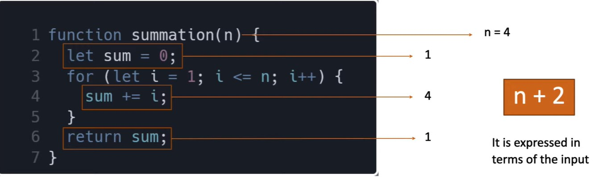

Total count is `n+2` and **our time complexity is dependent on input size**

So the worst case time complexity is O(n)- Linear: which means as the size of input increases the time complexity (steps to execute also increases.)

- Most of the time if you see a loop in out program, we can safely say that the time complexity is linear.


### O(1) - Constant

The time complexity of below program is O(1) which only needs one step to execute, doesn't matter the input size. the time complexity is constant always.

```javascript
function summation(n) {
    return (n * (n+1))/2
}
```


### O(n^2) - Quadratic
Most of the time when we have two nested loops, the time complexity is O(n^2).

```javascript
for (let i = 0; i< n.length; i++) {
    for(let j = 1; j<=i ; j++){
        //code
    }
}
```

### O(n^3) - Cubic
If there are three loops, the time complexity is cubic O(n^3);

```javascript
for (let i = 1; i< n; i++) {
    for(let j = 1; j<=i ; j++){
        for(let k = j; k <= j; k++){
            //some code
        }
    }
}
```

### O(log n) - Logarithmic
If input size reduces by half every iteration, then the time complexity is logarithmic.


## Space Complexity
same as time complexity.
- constant O(1): Always same memory it takes.
- Linear O(n): space complexity grows as the input size increases.
- Logarithmic O(log n): the space grows but not as the same rate as input.

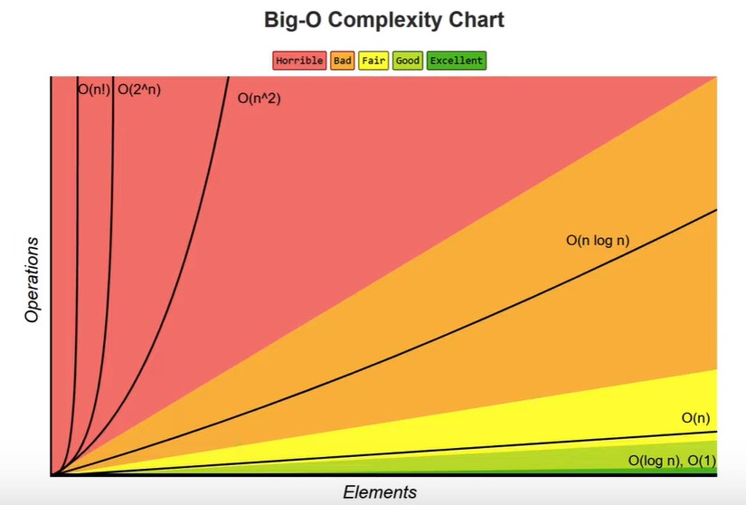

## Few points to note
- Multiple algorithm exist for same problem and there is no one right solution. Different algorithms work well under different constraints.
- The same algorithm with the same programming language can be implemented in different ways.
- When writing programs at work, don't lose sight of the big picture. rather than writing clever code, write code that is simple to read and maintain.


## Objects - Big-O
an object is a collection of key and value pairs.
- Property Insert: O(1)
- Property Remove: O(1)
- Accessing Value: O(1) 
- Searching value: O(n)- worst case scenario, we are gonna go through all properties. 
- Object.keys(): O(n) - worst case scenario, we are gonna go through all properties. 
- Object.values(): O(n) - worst case scenario, we are gonna go through all properties. 
- Object.entities(): O(n) - worst case scenario, we are gonna go through all properties.


## Array - Big-O
an Array is on ordered collection of values.

- Insert/remove at end: O(1);
- Insert/remove at beginning: O(n): This is because the index of remaining elements in the array has to be reset.
- Accessing: O(1): fetching an element in the beginning is not different than an element in 1000th index.
- Searching: O(n): who knows the element can be the last in the array.
### Methods:
- push/pop: O(1)
- shift/unshift/concat/slice/splice: O(n): because the index of remaining elements in the array has to be reset.

- forEach/map/filter/reduce: O(n)


# Math Algorithms:
## Fibonacci Sequence
Give a number n, find the first n elements of the fibonacci sequence.

In mathematics, Fibonacci sequences is a sequence  in which each number is the sum of the two preceding ones.
The first two numbers in the sequence are 0 and 1.

For example, 
- Fibonacci(2) = [0, 1]
- Fibonacci(3) = [0, 1, 1]
- Fibonacci(7) = [0, 1, 1, 2, 3, 5, 8 ]

```javascript
function FS (n) {
    let fib = [0,1]
    for(let i=2; i< n; i++ ){
        fib[i] = fib[i-1] + fib[i-2];
    }
    return fib;
}

console.log(FS(7))
```
Big-O = O(n)


## Factorial of a number
Give an integer n, find the factorial of that integer.

```javascript
function factorial (n) {
    let result = 1;
    for (let i = 1; i <= n; i++){
        result *= i;
    }
    return result;
}
console.log(factorial(4))//24
console.log(factorial(5))//120

```

Big-O = O(n)


## Prime Number:
Give an integer n, find if the number is Prime or not.

A prime number is a natural number greater than 1 that is not a product of two smaller natural numbers.

- 5 = true: 1 X 5 or 5 X 1
- 4 = false: 1 X 4 or 2 X 2 or 4X1


```javascript
function prime (n) {
    if (n <2){
        return false;
    }

    for (let i = 2; i<n; i++){
        if(n%i===0) return false
    }
    return true
}

console.log(prime(4))
console.log(prime(5))
```

Big-O = O(n)

#### Optimized Primality Test
Integers larger than the square root do not need to be checked because, whenever n= a*b , one of the two factors a and b is less than or equal to the square root of n.
n = 24, a=4, b=6
- The square root of 24 is 4.89: 4 is less than 4.89. So, `a` is less than the square root of n.

n=35 -> a=5, b=7
- The square root of 35 is 5.91: 5 is less than 5.91. So, `a` is less than the square root of n.

```javascript
function prime (n) {
    if (n <2){
        return false;
    }

    for (let i = 2; i<=Math.sqrt(n); i++){
        if(n%i===0) return false
    }
    return true
}

console.log(prime(4))
console.log(prime(5))
```

The number of N increases the number time complexity also increases but the same proportion as in the first solution.

As we only go through Sqrt(n) times in the loop: **Big-0 = O(sqrt(n))**


## Power of Two
Give a positive integer n, find if the number is a power of 2 or not.
1= 2^0;
2= 2^1;
5= false

```javascript
//solution1
function power (n) {
    return Number.isInteger(Math.log2(n))
}
console.log(power(4))
//Big-0 = 0(log n)


//Solution2
const power2 = (n) =>{
    let number = n;
    while(number > 1){
        number = number/2;
    }
    return number ===1 ? true: false
}
console.log(power(5))
//Big-0 = 0(log n)
```


## Recursion
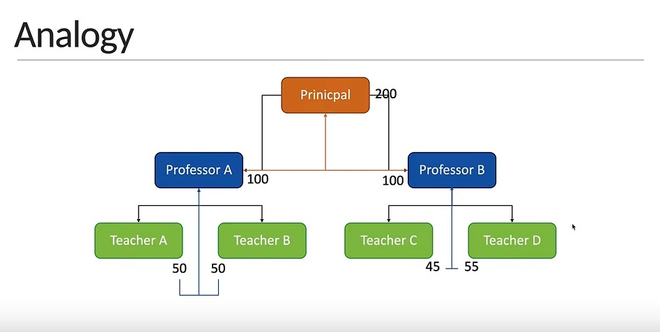


### Recursive Fibonacci Sequence
give a number n, find the nth element of the fibonacci sequence.

the first two elements of the fibonacci sequence are 0 and 1. (0,1,1,2,3,5,8)

- recursiveFibonacci(0) = 0
- recursiveFibonacci(1) = 1
- recursiveFibonacci(6) = 8


```javascript
function recursiveFibSec(n){
    if (n<2) return n;
    return recursiveFibSec(n-1) + recursiveFibSec(n-2)
}
console.log(recursiveFibSec(6)) //8
```

#### Time complexity for recursive Fibonacci Sequence:

Big-O = O(2^n)

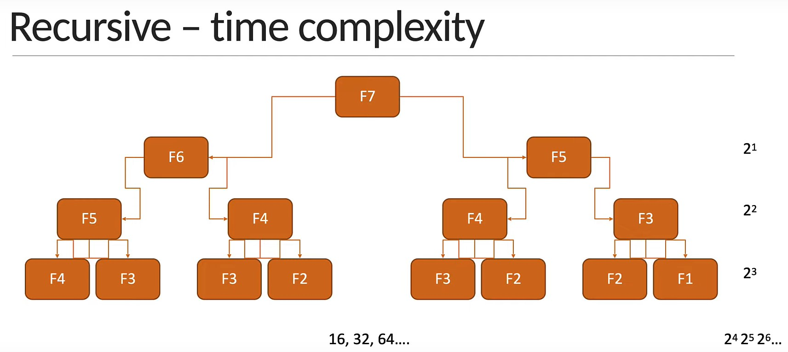


### Recursive Factorial of a number
Give an integer n, find the factorial of that integer.

```javascript
function recursiveFactorial (n){
    if (n === 0) return 1;
    return  n * recursiveFactorial(n-1);
}

console.log(recursiveFactorial(5))
```

Big-O = O(n)


# Search Algorithms
## 1. Linear search
### Problem:
Given an array of `n` elements and a target element `t`. find the index of the target element. Return -1 if the target element is not found.

- n=[-5,2,10,4,6]
- t=10

```javascript
//First Solution:
function linearSearch (n, t){
    if(n.includes(t)) {
        return n.findIndex(el => el === t)
    }
    return -1
}

//Second Solution:
function linearSearch (n, t){
    for(let i = 0; i < n.length; i++){
        if(n[i] === t) return i
    }
    return -1
}
console.log(linearSearch([-5,2,10,4,6],10)) //2
console.log(linearSearch([-5,2,10,4,6],6)) //4
console.log(linearSearch([-5,2,10,4,6],20)) // -1
```

## 2. Binary search
Binary search works only on sorted arrays.
### Problem:
Given a sorted array of `n` elements and a target element `t`, find the index of the target element.


```javascript
function binarySearch (n,t){
    let leftIndex = 0;
    let rightIndex = n.length - 1;

    while (leftIndex <= rightIndex) {
        let middleIndex = Math.floor((leftIndex + rightIndex)/2);
        if(t === n[middleIndex]) {
            return middleIndex;
        }
        if(t < n[middleIndex]) {
            rightIndex = middleIndex -1;
        }else{
            leftIndex = middleIndex + 1;
        }
    }
    return -1;
}
console.log(binarySearch([2,4,7,9,15,18], 20))//-1
console.log(binarySearch([2,4,7,9,15,18], 9)) //3
```

Big-O : O(log(n)): 


## 3. Recursive Binary search
```javascript
function binarySearch (n,t){
    return search (n, t, 0, n.length - 1)
}

function search(arr, target, leftIndex, rightIndex){
    if(leftIndex > rightIndex) return -1;

    let middleIndex = Math.floor((leftIndex + rightIndex)/2);
    if(target === arr[middleIndex]) return middleIndex

    if(target< arr[middleIndex]) {
        return search(arr, target, leftIndex, middleIndex -1 )
    } else{
        return search(arr, target, middleIndex+1, rightIndex)
    }
}
console.log(binarySearch([2,4,7,9,15,18], 10))//-1
console.log(binarySearch([2,4,7,9,15,18], 15))//4
```

Big-0: O(log(n))


# Sorting Algorithms
## Bubble Sort:
Compare adjacent elements in the array and swap the positions if they are not in the intended order.
Repeat the instructions as you step through each element in the array. Once you step through the whole array with no swaps, the array is sorted.

```javascript
function bubbleSort (arr){
    let swapped;
    do {
        swapped = false;
        for (let i = 0; i < arr.length-1; i++) {
            if(arr[i]> arr[i+1]){
                let temp = arr[i];
                arr[i] = arr[i+1];
                arr[i+i]= temp;
                swapped = true
            }
        }
    } while (swapped);
}
const arr = [5,4,2,-2]
bubbleSort(arr)
console.log(arr)
```
Big-O: We are using two loops, (for loops and do-while loops), so the Big-O is O(n^2)

## Insertion Sort:
- Virtually split the array into a sorted and unsorted part.
- Assume that the first element is already sorted and remaining elements are unsorted.
- Select an unsorted element and compare with all elements in the sorted part. 
- If the elements in the sorted part is smaller than the selected element, proceed to the next element in the unsorted part. Else, shift larger elements in the sorted part towards the right.
- insert the selected element at the right index. z
- repeat till the unsorted elements are placed in the right order.
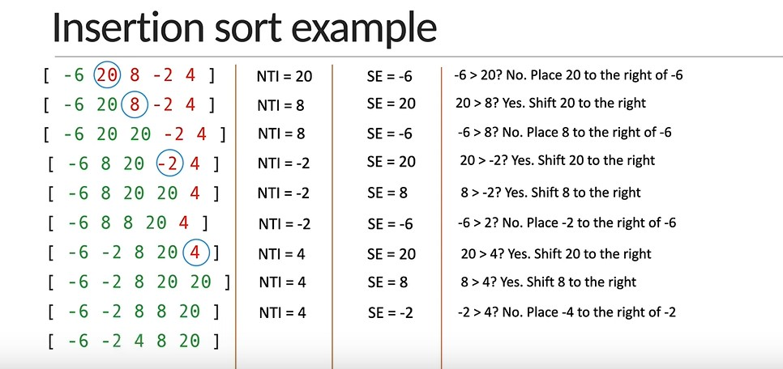

```javascript
//InsertionSort:
function insertionSort (arr){
    for (let i = 1; i< arr.length; i++){
        let position = i;
        let tempValue = arr [position]
        while (position > 0 && arr[position -1] > tempValue){
            arr[position] = arr[position -1];
            position = position -1;
        }
        arr[position] = tempValue;
    }
}
const arr2 = [5,4,2,-2]
insertionSort(arr2)
console.log(arr2)
```
WorstCaseScenario: as we have two loops in insertion: Big-0 = O(n^2)

## Quick Sort:
- Identify the pivot element in the array:
    - Pick the first element as the pivot.
    - Pick the last element as the pivot (our approach).
    - Pick a random element as the pivot.
    - Pick median as pivot.
- Put everything that is smaller than the pivot into a `left` array and everything that's greater than the pivot into a `right` array.
- Repeat the process for the individual `left` and `right` arrays till you have an array of length `1` which is sorted by definition.
- Repeatedly concatenate the left array, pivot and right array till one sorted array remains.


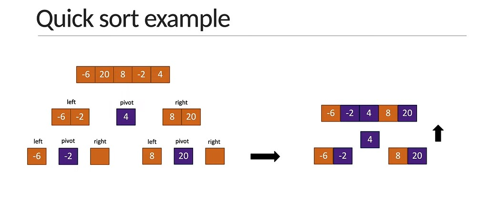

```javascript
function quickSort (arr) {
    if(arr.length<2) return arr
    
    let pivot = arr[arr.length - 1];
    let left = [];
    let right = [];

    for (let i=0; i<arr.length-1; i++){
        arr[i] < pivot?
        left.push(arr[i]):
        right.push(arr[i])
    }
    return [...quickSort(left), pivot, ...quickSort(right)]
}

let arr23 = [5,4,2,-2]
console.log(quickSort(arr23))
```
- WorstCaseScenario: O(n^2)
- AverageScenario: O(n log n)


## Merge Sort:
- Divide the array into sub arrays, each containing only one element (An array with one element is considered sorted).
- Repeatedly merge the sub arrays to produce new sorted sub arrays until there is only one sub array remaining. That will be the sorted array.

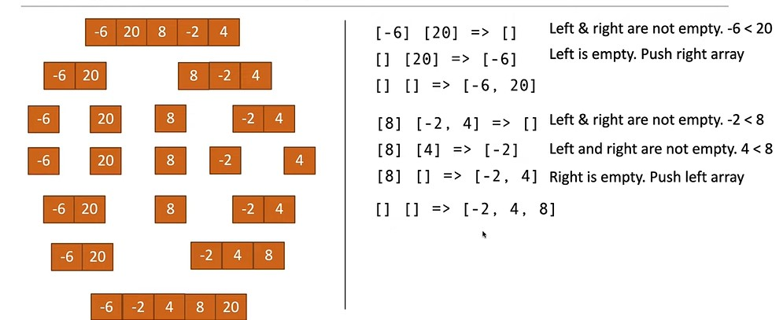

```javascript
function mergeSort (arr) {
    if(arr.length < 2) return arr

    const mid = Math.floor(arr.length / 2)
    const leftArray = arr.slice(0,mid);
    const rightArray = arr.slice(mid);
    return merge(mergeSort(leftArray), mergeSort(rightArray))
}

function merge (leftArray, rightArray) {
    const sortedArray = [];
    while(leftArray.length && rightArray.length) {
        if(leftArray[0] <= rightArray[0]){
            sortedArray.push(leftArray.shift())
        }else{
            sortedArray.push(rightArray.shift())
        }
    }
    return [...sortedArray, ...leftArray, ...rightArray]
}
let arr5 = [5,4,2,-2]
console.log(mergeSort(arr5))
```

**WorstCaseScenario**: O(n log n). and this is the best sort complexity we can get when sorting.

# Miscellaneous Problems
## Cartesian Product
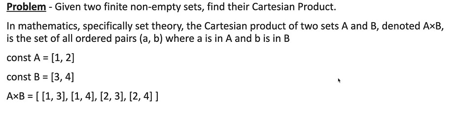

```javascript
function cartesianProduct (a, b) {
    const result =[]
    for (i in a ) {
        for (j in b ) {
            result.push(a[i]*b[j])
        }
    }
    return result
}
console.log(cartesianProduct([2,3,4], [2,3]))
```

## Climbing Staircase
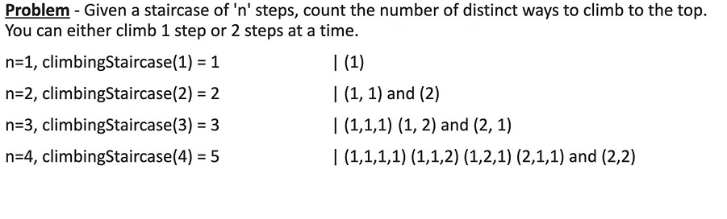

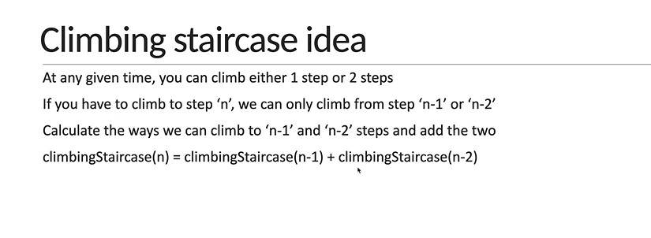

### Implementation:
- `n`: The number of steps in the staircase.
- Constraints: Then number of take one step is `1` and the number of take two step is `2`. So, [1, 2].

```javascript
function climbingStaircase (n){
    const noOfWays = [1,2];
    for(let i =2; i <= n; i++){
        noOfWays[i] = noOfWays[i-1] + noOfWays[i-2]
    }
    return noOfWays[n-1]
}
```
Time Complexity: O(n)

## Tower of Hanoi
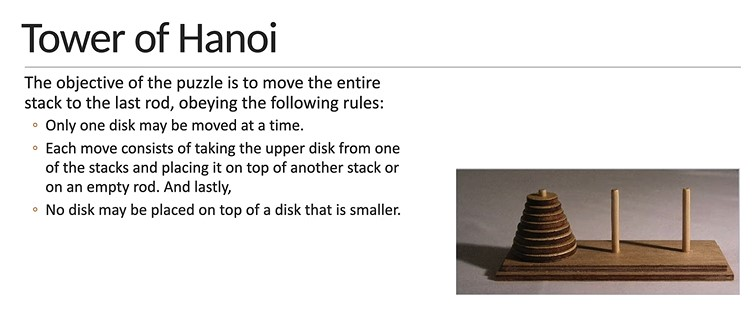

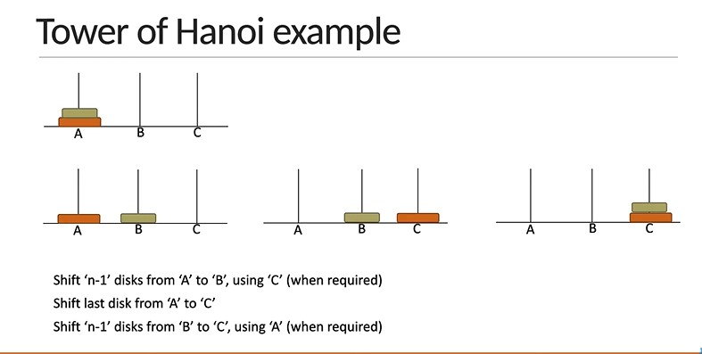


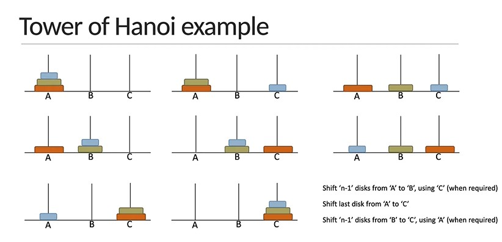

### Implementation:

```javascript
function towerOfHanoi(n, fromRod, toRod, usingRod){
    if(n===1){
        console.log(`Move desk 1 from ${fromRod} to ${toRod}`);
        return;
    }

    towerOfHanoi(n-1, fromRod, usingRod, toRod);
    console.log(`Move desk ${n} from ${fromRod} to ${toRod}`);
    towerOfHanoi(n-1, usingRod, toRod, fromRod)
}
towerOfHanoi(3, 'A', 'C', 'B')
```

TimeComplexity: O(2^n);

# Algorithm Design Techniques:

Algorithms are sets of instructions that are designed to solve specific problems or perform specific tasks. There are several techniques used in algorithm design, each with its strengths and weaknesses. Here are some of the most commonly used algorithm design techniques:

- Brute force: This technique involves trying every possible solution to a problem until the correct one is found. While brute force algorithms are often slow and inefficient, they can be useful for small problems or for verifying the correctness of other algorithms. Ex: Linear Search

- Divide and conquer: This technique involves breaking a problem into smaller sub-problems and solving each sub-problem separately. The solutions to the sub-problems are then combined to produce a solution to the original problem. Divide and conquer algorithms are often faster than brute force algorithms, but they can be more difficult to design. Ex: Binary Search, Quick Sort, Merge Sort and Tower of Hanoi.

- Dynamic programming: This technique involves breaking a problem into smaller sub-problems and solving each sub-problem only once, storing the solution in memory for future reference. Dynamic programming can be more efficient than brute force or divide and conquer algorithms for certain types of problems. Ex: Fibonacci numbers and climbing staircase. 

- Greedy algorithms: This technique involves making the locally optimal choice at each step in the algorithm, with the hope that the globally optimal solution will be reached. Greedy algorithms are often fast and easy to implement, but they can sometimes produce suboptimal solutions. Ex: Dijkstra's algorithm, Prim's algorithm and Kruskal's algorithm.


- Backtracking: This technique involves searching through all possible solutions to a problem, but stopping the search as soon as a solution is found. Backtracking algorithms are often used for problems that have a large number of possible solutions. N-Queens problem.

- Randomized algorithms: This technique involves using randomization to generate a solution to a problem. Randomized algorithms can be useful when the problem is too complex to solve using other techniques or when an approximate solution is acceptable.

Each algorithm design technique has its own advantages and disadvantages, and the choice of technique will depend on the specific problem being solved and the resources available.